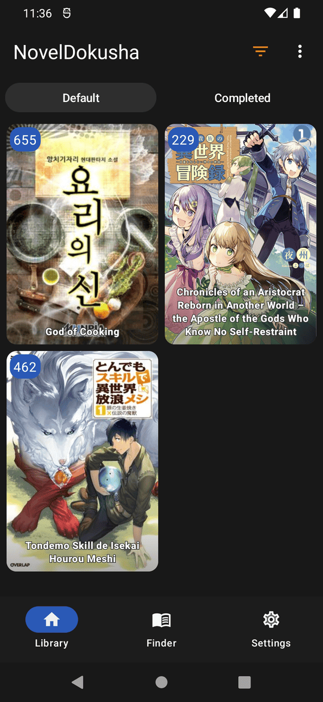
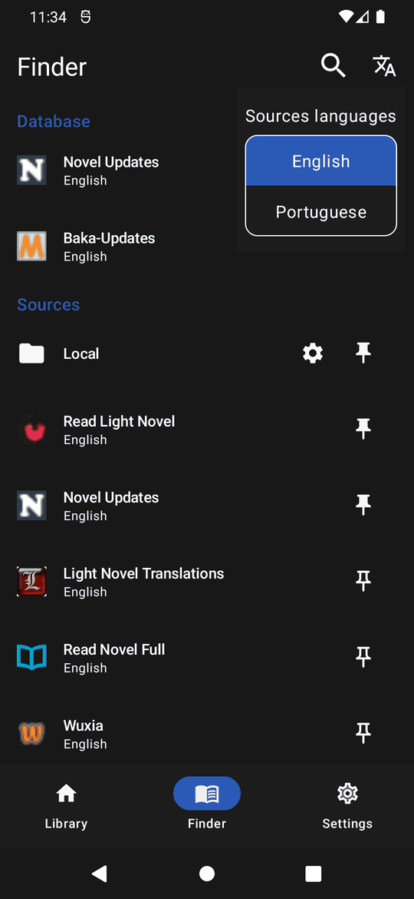
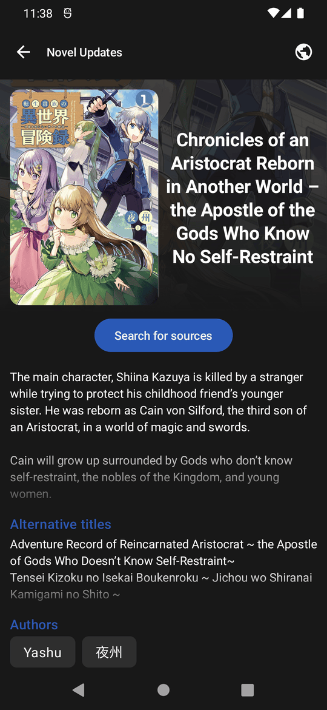
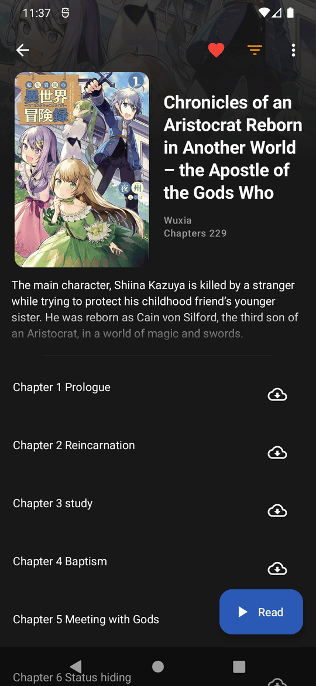
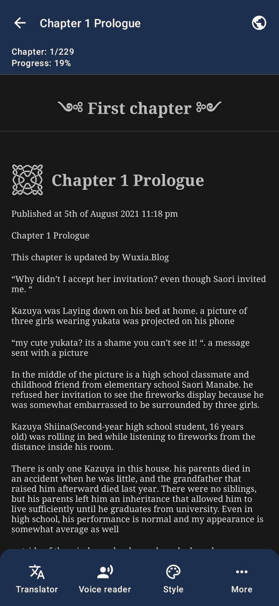
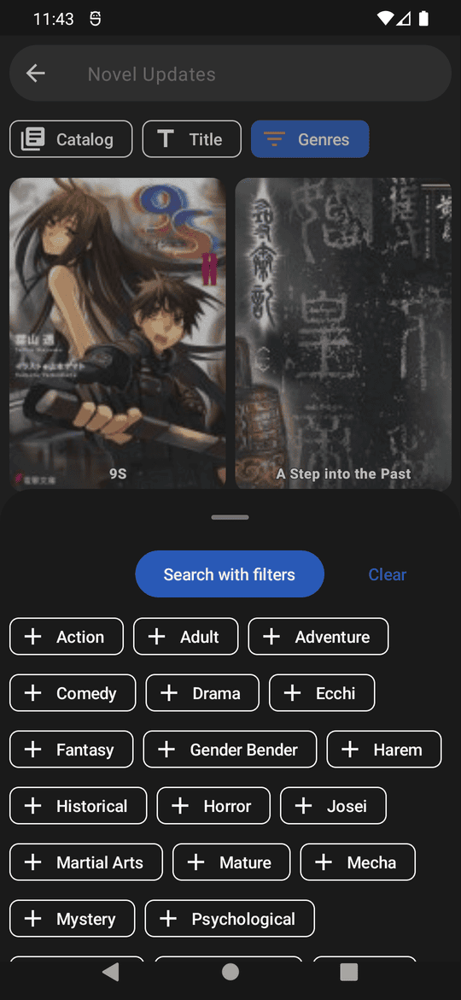
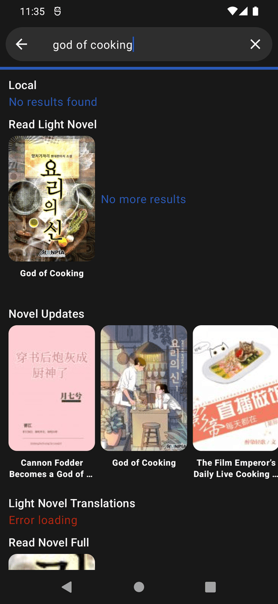

# NovelDokusha

An Android web novel reader focused on simplicity and reading immersion. Search from a large catalog of sources, open your pick and just enjoy.

> **Fork status:** This is a community fork of [nanihadesuka/NovelDokusha](https://github.com/nanihadesuka/NovelDokusha) (originally v2.2.0). The original project is no longer maintained. This fork adds Gemini-powered AI translation, additional sources, and ongoing fixes.

---

## Screenshots

|              Library               |                Finder                |
|:----------------------------------:|:------------------------------------:|
|        |           |
|             Book info              |            Book chapters             |
|      |     |
|               Reader               |           Database search            |
|         |  |
|           Global search            |                                      |
|  |                                      |

---

## Features

### Library & Discovery
- **Multiple sources**: 30+ built-in novel sources spanning English, Chinese, Japanese, Korean, Indonesian, Portuguese, and Vietnamese catalogs.
- **Multiple databases**: Cross-source novel lookup via NovelUpdates and BakaUpdates.
- **Local source**: Read locally-stored EPUB files directly in the reader.
- **Global search**: Search across all enabled sources simultaneously.
- **Library tracking**: Save novels to your library and track read progress.
- **Backup & restore**: Export and import your library, progress, and settings.

### Reader
- **Infinite scroll**: Continuous reading without page interruptions.
- **Custom fonts**: Pick any installed font, adjust font size, line height, and margins.
- **Live translation** (full flavor only): On-device translation between 50+ languages using Google ML Kit — no internet calls, fully offline after model download.
- **AI translation (new)**: Gemini-powered translation source for high-quality, fluent translation of Chinese novels with glossary support, two-pass refinement, and smart batching.
- **Text to speech**: Listen to chapters with background playback, notification controls, voice selection, adjustable pitch and speed.

### UI / UX
- **Material 3** design with dynamic color support on Android 12+.
- **Light & dark themes** with true black AMOLED mode.
- **Hybrid view system**: Modern Jetpack Compose UI layered on top of legacy XML views for incremental migration.

---

## Sources

The app ships with 30+ pre-configured sources. Each implements a common `SourceInterface` so adding a new source is as simple as dropping a new Kotlin file into `scraper/src/main/java/my/noveldokusha/scraper/sources/`.

### Catalog sources (English)
- Royal Road, LightNovelsTranslations, ReadLightNovel, ReadNovelFull, NovelUpdates, BestLightNovel, 1stKissNovel, BoxNovel, LightNovelWorld, NovelHall, WuxiaWorld, KoreanNovelsMTL, NovelBin, Reddit, Sousetsuka

### Catalog sources (Other languages)
- **Indonesian**: IndoWebnovel, BacaLightnovel, SakuraNovel, MeioNovel, MoreNovel, Novelku, WbNovel
- **Chinese**: TimoTxt, TimoTxt (Translate), TimoTxt (Gemini)
- **Portuguese**: Saikai
- **Vietnamese**: Wuxia
- **Japanese**: AT

### Translation sources (this fork)
| Source | Mechanism | Quality | Speed | Cost |
|---|---|---|---|---|
| **TimoTxt** | None (original Chinese) | — | Instant | Free |
| **TimoTxt (Translate)** | Google Translate proxy via `translate.goog` URL rewrite | Medium | Fast | Free |
| **TimoTxt (Gemini)** ✨ new | Gemini 2.5 Flash / Flash-Lite API with two-pass refinement, glossary support, JSON-chunked delivery, smart batching | High | 4–8 s per chapter batch | Free tier (10 RPM / 250 RPD on flash) |

The Gemini source exposes additional settings (see [Gemini AI Translation Settings](#gemini-ai-translation-settings) below).

---

## Gemini AI Translation Settings

The **TimoTxt (Gemini)** source uses Google's Gemini API for translation. To enable it:

1. Get a free API key at [Google AI Studio](https://aistudio.google.com/app/apikey).
2. Open **Settings → Gemini AI Translation** in the app.
3. Paste your API key.
4. Choose a model:
   - `gemini-2.5-flash` — best quality, 10 RPM / 250 RPD free tier
   - `gemini-2.5-flash-lite` — faster & higher quota, 30 RPM / 1000 RPD free tier
   - Custom model name (any Gemini model you have access to)
5. Optionally tune the **temperature** slider (default 0.55 — the sweet spot between literal and fluent).

### Features of the Gemini translator
- **Two-pass translation**: Pass 1 produces a literal translation; pass 2 refines it into fluent English while preserving names and tone.
- **Glossary support**: Define custom term mappings (e.g. 主角 → "protagonist") that are dynamically injected into each prompt.
- **Smart batching**: 2–3 chapters per API request to reduce total API calls.
- **JSON-wrapped chunking**: Each batch is wrapped in a JSON envelope so partial failures can be recovered without re-translating the whole batch.
- **Context caching**: World-building context and glossary are cached to save tokens on subsequent chapters.
- **Safety filter bypass**: Uses `BLOCK_ONLY_HIGH` safety settings so mature novel content isn't blocked.
- **Rate-limit aware**: Tracks RPM/RPD usage and backs off automatically.
- **CJK detection guard**: Detects if the API returned untranslated Chinese text (e.g. due to safety filter) and retries or shows an error instead of caching bad output.

---

## Tech Stack

| Layer | Technology |
|---|---|
| **Language** | Kotlin 1.9.23 |
| **UI** | Jetpack Compose 1.6.8 + legacy XML views (incremental migration) |
| **Design** | Material 3 |
| **Async** | Kotlin Coroutines 1.7.3 |
| **Reactive state** | LiveData, Flow |
| **Storage** | Room 2.6.1 (SQLite) |
| **Networking** | OkHttp 5.0.0-alpha.11, Retrofit 2.9.0 |
| **HTML parsing** | Jsoup 1.17.2, Readability4J 1.0.8, Crux 5.0 |
| **Serialization** | Gson 2.10.1, Moshi 1.15.0, kotlinx.serialization 1.5.1 |
| **Image loading** | Coil 2.4.0, Glide (via Landscapist) |
| **DI** | Hilt 2.49 + Dagger AndroidX 1.2.0 |
| **Translation** | Google ML Kit 17.0.2 (full flavor only) |
| **AI translation** | Google Gemini API (via direct REST, no SDK dependency) |
| **TTS** | Android TextToSpeech + Media session for notification controls |
| **Background work** | WorkManager 2.9.0 |
| **Logging** | Timber 5.0.1 |

---

## Project Architecture

The project follows a multi-module clean architecture with feature modules. Each module has a single responsibility and depends only on its declared dependencies.

```
NovelDokusha/
├── app/                          # Application entry point, DI graph, navigation
├── build-logic/                  # Gradle convention plugins (shared build config)
│   └── convention/               #   - AppConfig (compileSdk, minSdk, Java version)
├── core/                         # Shared core utilities, PagedList, LiveEvent
├── coreui/                       # Shared Compose UI components, themes
├── data/                         # Data layer: repositories, Room DAOs
├── features/                     # Feature modules (one per screen area)
│   ├── catalogExplorer/          #   - Source catalog browser
│   ├── chaptersList/             #   - Chapter list for a book
│   ├── databaseExplorer/         #   - Database (NovelUpdates) browser
│   ├── globalSourceSearch/       #   - Cross-source search
│   ├── libraryExplorer/          #   - User's library
│   ├── reader/                   #   - The reader screen + TTS
│   ├── settings/                 #   - Settings (incl. Gemini config)
│   ├── sourceExplorer/           #   - Single source browser
│   └── webview/                  #   - Embedded WebView for sources that need it
├── navigation/                   # Navigation graph definitions
├── networking/                   # OkHttp client, request helpers
├── scraper/                      # Source & database scrapers
│   └── src/main/java/.../sources/  # 30+ source implementations
├── strings/                      # String resources
└── tooling/                      # Reusable tooling libraries
    ├── algorithms/               #   - Pure-Kotlin algorithms (FuzzyMatch, etc.)
    ├── application_workers/      #   - WorkManager workers (downloads, etc.)
    ├── backup_create/            #   - Backup file creator
    ├── backup_restore/           #   - Backup file importer
    ├── epub_importer/            #   - EPUB → local source
    ├── epub_parser/              #   - EPUB file parser
    ├── local_database/           #   - Local Room DB for library
    ├── local_source/             #   - Local files as a "source"
    ├── text_to_speech/           #   - TTS manager
    └── text_translator/          #   - Translation abstraction
        ├── domain/               #     - Translation interface
        ├── translator/           #     - ML Kit impl (full flavor)
        └── translator_nop/       #     - No-op impl (foss flavor)
```

### Module dependency graph (simplified)

```
                     ┌────────────┐
                     │     app    │
                     └─────┬──────┘
                           │
        ┌──────────────────┼──────────────────┐
        │                  │                  │
   ┌────▼─────┐      ┌─────▼──────┐    ┌─────▼─────┐
   │ features │      │    data    │    │ scraper   │
   └────┬─────┘      └─────┬──────┘    └─────┬─────┘
        │                  │                  │
        └──────────────────┼──────────────────┘
                           │
        ┌──────────────────┼──────────────────┐
        │                  │                  │
   ┌────▼─────┐      ┌─────▼──────┐    ┌─────▼─────┐
   │  coreui  │      │   core     │    │networking │
   └──────────┘      └────────────┘    └───────────┘
```

### Build flavors

The app has two product flavors on the `dependencies` dimension:

| Flavor | Translation module | Use case |
|---|---|---|
| **full** | `tooling.text_translator.translator` (ML Kit + Play Services) | Default — full translation features, works on any device with Google Play |
| **foss** | `tooling.text_translator.translator_nop` (no-op stub) | 100% Google-free APK for F-Droid / degoogled devices |

Both flavors produce separate APKs. The Gemini translation source works identically in both flavors (it only depends on the network layer, not ML Kit).

---

## Build

### Prerequisites
- **JDK 17** (matches `AppConfig.javaVersion` in `build-logic/convention/.../AppConfig.kt`)
- **Android SDK** with `platforms;android-34` and `build-tools;34.0.0`
- **Gradle 8.2** (provided by the wrapper, no separate install needed)

### Build flavors & types

| Variant | Command | Output path |
|---|---|---|
| Full debug | `./gradlew assembleFullDebug` | `app/build/outputs/apk/full/debug/*.apk` |
| FOSS debug | `./gradlew assembleFossDebug` | `app/build/outputs/apk/foss/debug/*.apk` |
| Full release | `./gradlew assembleFullRelease` | `app/build/outputs/apk/full/release/*.apk` |
| FOSS release | `./gradlew assembleFossRelease` | `app/build/outputs/apk/foss/release/*.apk` |

### Local build

1. Create `local.properties` pointing to your Android SDK:
   ```properties
   sdk.dir=/path/to/your/Android/Sdk
   ```
2. Make the wrapper executable:
   ```bash
   chmod +x gradlew
   ```
3. Build a debug APK:
   ```bash
   ./gradlew assembleFullDebug
   ```

The debug APK is signed automatically with the auto-generated debug keystore and can be installed directly on any device with USB debugging enabled.

### Release builds

Release APKs require a signing keystore. Create one:

```bash
keytool -genkey -v \
  -keystore release.keystore \
  -storepass YOUR_STORE_PASSWORD \
  -alias YOUR_ALIAS \
  -keypass YOUR_KEY_PASSWORD \
  -keyalg RSA -keysize 2048 -validity 10000 \
  -dname "CN=Your Name,O=Your Org,C=US"
```

Then create `custom.properties` in the project root:

```properties
storeFile=release.keystore
storePassword=YOUR_STORE_PASSWORD
keyAlias=YOUR_ALIAS
keyPassword=YOUR_KEY_PASSWORD
```

Build with:

```bash
./gradlew assembleFullRelease -PlocalPropertiesFilePath=custom.properties
./gradlew assembleFossRelease -PlocalPropertiesFilePath=custom.properties
```

### ABI splits (optional)

For smaller per-architecture APKs:

```bash
./gradlew assembleFullRelease -PsplitByAbi -PsplitByAbiDoUniversal -PlocalPropertiesFilePath=custom.properties
```

This produces separate `arm64-v8a`, `armeabi-v7a`, `x86_64`, and (optionally) a universal APK.

---

## GitHub Actions Workflows

This repo includes several workflows in `.github/workflows/`:

| Workflow | File | Trigger | Purpose |
|---|---|---|---|
| **Build and Release Debug APK** | `build-apk.yml` | Push to `main` | Auto-build debug APKs on every commit, create a GitHub Release with both flavors |
| **Build and Release Signed APK (Manual)** ✨ new | `build-release-manual.yml` | Manual (`workflow_dispatch`) | Build R8-shrunk signed release APKs (~5 MB each) on demand. Optional version name and prerelease toggle. Uses an auto-generated debug keystore so no secrets required. |
| **Publish Release** | `buildRelease.yml` | Manual | Original author's release workflow — requires `SIGNING_KEY`, `KEY_STORE_PASSWORD`, `ALIAS`, `KEY_PASSWORD` secrets |
| **UI tests** | `ui_test.yml` | (see file) | Instrumented UI tests |

### Using the manual release workflow

1. Push your code to GitHub.
2. Go to **Actions** tab → **"Build and Release Signed APK (Manual)"**.
3. Click **"Run workflow"**.
4. Optionally enter a `version_name` (e.g. `2.2.3`). Leave blank for automatic semver patch bump.
5. Optionally check **"Mark release as prerelease"**.
6. Run. After ~6–8 minutes, both APKs will appear as a new GitHub Release.

The release APKs are signed with a freshly-generated debug keystore — they install fine on any device that allows "Unknown sources" but are **not** Play-Store-uploadable. For Play Store uploads, configure real signing secrets and use `buildRelease.yml`.

### Required repository settings for workflows

In **Settings → Actions → General → Workflow permissions**, set to **"Read and write permissions"** — this is needed so the workflow can create tags and releases.

---

## Adding a new source

Each source is a Kotlin class implementing `SourceInterface` (or its `Catalog` sub-interface). The pattern:

1. Create a new file in `scraper/src/main/java/my/noveldokusha/scraper/sources/YourSource.kt`.
2. Implement `SourceInterface` (for non-catalog sources like local files) or `SourceInterface.Catalog` (for sources with a browsable catalog).
3. Register the source in `Scraper.kt` — add it to the `sourcesList` set.
4. Done. It will appear in the source picker automatically.

Minimal example:

```kotlin
class YourSource @Inject constructor(
    private val networkClient: NetworkClient
) : SourceInterface.Catalog {
    override val id = "your_source_id"
    override val name = "Your Source"
    override val baseUrl = "https://example.com"
    override val language = "English"

    override suspend fun getCatalogList(index: Int): Response<PagedList<BookResult>> { ... }
    override suspend fun getCatalogSearch(index: Int, input: String): Response<PagedList<BookResult>> { ... }
    override suspend fun getBookCover(url: String): Response<BookResult> { ... }
    override suspend fun getChapterList(url: String): Response<List<ChapterResult>> { ... }
    override suspend fun getChapterText(url: String): Response<String> { ... }
}
```

For a real example, see `TimoTxt.kt` (simple HTML scraping) or `TimoTxtGemini.kt` (advanced: API-backed translation source).

---

## Adding a new translation database

Databases are cross-source lookup services (like NovelUpdates). To add one:

1. Create a new file in `scraper/src/main/java/my/noveldokusha/scraper/databases/YourDatabase.kt`.
2. Implement `DatabaseInterface`.
3. Register it in `Scraper.kt` — add it to the `databasesList` set.

---

## Project Conventions

- **Kotlin only**: No Java sources.
- **Hilt for DI**: All constructor injection, no `@Component` modules in feature code.
- **Coroutines everywhere**: `suspend` functions for I/O, `Dispatchers.IO` for blocking work.
- **Room for storage**: All persistence goes through Room DAOs in `data/`.
- **Compose for new UI**: New screens use Compose. Legacy XML views are kept until migration completes.
- **Single Activity**: The app uses a single `MainActivity` with Compose Navigation.
- **Reactive preferences**: `AppPreferences` exposes Flow-backed preference values.

---

## License

Copyright © 2023 [nani](https://github.com/nanihadesuka). Released under [GPL-3](LICENSE).

This fork maintains the same GPL-3 license. All derivative work must also be GPL-3.
